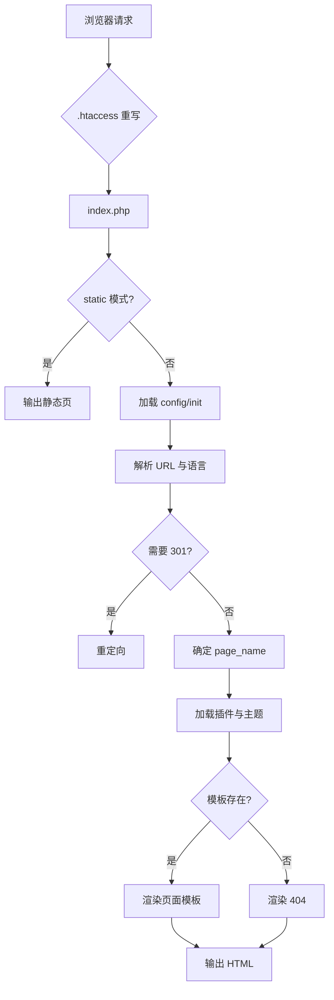

# 请求生命周期

CloudArcade 采用 **FRONT CONTROLLER**（前端控制器）模式：所有前台请求都进入 `index.php`，由其负责 URL 解析、多语言处理、路由分发与页面渲染。本文以一次完整的页面访问为例，梳理请求从进入到输出的全过程。

## 整体流程

```
浏览器请求 /game/my-game
        │
        ▼
.htaccess 重写为 index.php?viewpage=game/my-game
        │
        ▼
index.php（前端控制器）
  1. 开启会话
  2. 加载 config.php / init.php（配置、数据库、公共函数）
  3. 解析 URL 参数与语言代码
  4. 处理 PRETTY URL / TRAILING SLASH 重定向
  5. 确定 $page_name（viewpage）
  6. 加载插件与主题函数
  7. 分发到对应页面模板（includes/page-*.php）
        │
        ▼
输出 HTML
```

## 第一步：URL 重写（.htaccess）

Apache 通过 `.htaccess` 将除真实文件/目录外的所有请求重写为前端控制器入口：

```apache
Options +FollowSymLinks
RewriteEngine On

RewriteCond %{SCRIPT_FILENAME} !-d
RewriteCond %{SCRIPT_FILENAME} !-f

RewriteRule ^(.*)$ ./index.php?viewpage=$1
```

因此访问 `/game/my-game` 实际执行的是 `index.php?viewpage=game/my-game`。

## 第二步：入口初始化（index.php）

```php
if (session_status() == PHP_SESSION_NONE) {
    session_start();
}
define('IS_VISITOR_PAGE', true);

// 静态站点模式（若有 static 目录则直接输出静态页面）
if (file_exists('static') && !defined('NO_STATIC')) { ... }

require('config.php');   // 检测安装状态、加载 connect.php
require('init.php');     // 会话、常量、数据库连接、公共函数
require('classes/Collection.php');
require('includes/plugin.php');  // 插件系统
```

### init.php 的关键职责

- 定义 `ABSPATH`、`ADMIN_PATH`、`CLASS_PATH` 常量
- 加载 `site-settings.php`（站点设置常量）
- 加载核心类（`includes/load-class.php`）
- 加载公共函数（`includes/commons.php`）、游戏列表辅助（`game_list.php`）、会话（`sessions.php`）
- 提供 `open_connection()`：创建/复用 **PDO** 数据库连接，并做存活检测

## 第三步：URL 解析与多语言

### URL 参数提取

```php
if (PRETTY_URL) {
    // 从 REQUEST_URI 拆分路径段
    $url_params = array_values(array_filter(explode('/', urldecode(parse_url($_SERVER['REQUEST_URI'], PHP_URL_PATH)))));
} else {
    if (isset($_GET['viewpage'])) {
        $url_params = array_values(array_filter(array_map('trim', $_GET)));
    }
}
```

- `PRETTY_URL` 开启时：按 `/` 拆分路径（如 `game/my-game` → `['game', 'my-game']`）
- 关闭时：直接使用 `$_GET` 参数
- 若配置了 `SUB_FOLDER`（子目录部署），会自动剔除第一段目录名

### 多语言处理

支持两种语言模式：

1. **参数切换**：`?lang=en` 直接切换语言
2. **URL 语言代码**：`lang_code_in_url` 开启后，URL 形如 `/en/game/...`，首段为语言代码

```php
$lang_code = get_setting_value('language');  // 默认语言
if (array_key_exists('lang', $_GET)) {       // ?lang= 参数优先
    $lang_code = $_GET['lang'];
}
// 语言文件不存在时回退到 en
$file = ABSPATH . 'locales/public/' . $lang_code . '.json';
if (!file_exists($file) && $lang_code != 'en') { ... $lang_code = 'en'; }
```

随后调用 `load_language('index')` 加载对应语言包。

### URL 规范化重定向

为保证 **SEO** 一致性，入口会做以下 301 重定向：

- URL 缺少语言代码时，跳转到带语言代码的版本
- 启用了 **TRAILING SLASH** 时，补全末尾 `/`
- 自定义路径（`get_custom_path`）与基础路径不一致时，跳转到自定义路径

```php
header("HTTP/1.1 301 Moved Permanently");
header("Location: $redirect_url");
exit();
```

## 第四步：页面分发

```php
$page_name = isset($_GET['viewpage']) ? $_GET['viewpage'] : 'homepage';
$base_taxonomy = get_base_taxonomy($page_name);   // 归一化基础页面类型

require_once(ABSPATH . 'content/themes/theme-functions.php');
load_plugins('index');                             // 触发插件钩子
require_once(TEMPLATE_PATH . '/functions.php');    // 主题函数

// 分发规则
if (file_exists('includes/page-' . $base_taxonomy . '.php')) {
    require('includes/page-' . $base_taxonomy . '.php');
} else if (file_exists(TEMPLATE_PATH . '/page-' . $page_name . '.php')) {
    require(TEMPLATE_PATH . '/page-' . $page_name . '.php');  // 主题自定义页面
} else {
    require('includes/page-404.php');
}
```

### 页面类型对照

| viewpage | 模板文件 | 说明 |
| --- | --- | --- |
| (空) | `page-homepage.php` | 首页 |
| game | `page-game.php` | 游戏详情页 |
| category | `page-category.php` | 分类页 |
| tag | `page-tag.php` | 标签页 |
| archive | `page-archive.php` | 归档页 |
| collection | `page-collection.php` | 合集页 |
| search | `page-search.php` | 搜索页 |
| post | `page-post.php` | 文章页 |
| page | `page-page.php` | 自定义页面 |
| user | `page-user.php` | 用户中心 |
| user-profile | `page-user-profile.php` | 用户资料页（公开） |
| user-edit | `page-user-edit.php` | 用户编辑资料 |
| full | `page-full.php` | 全屏游戏页 |
| login / register | `page-login.php` / `page-register.php` | 登录/注册 |
| splash | `page-splash.php` | 启动页 |
| 其他/不存在 | `page-404.php` | 404 页面 |

`get_base_taxonomy()` 用于将别名映射为统一的基础类型，例如 `homepage` 与 `home` 可能映射为同一处理逻辑。

## 第五步：输出与收尾

页面模板通过 `commons.php` 中的函数（如 `get_permalink()`、`get_game_url()`）生成链接与内容，最终输出完整 HTML。插件通过 `load_plugins()` 注入头部/底部脚本。

## 后台入口对比

| 入口 | 路径 | 说明 |
| --- | --- | --- |
| 前台 | `/` → `index.php` | 公开访问 |
| 后台 | `/admin.php` | 加载 `admin/request.php`，校验管理员权限后分发到 `admin/core/*` |

后台同样有独立的权限校验与路由机制，详见 [后台总览](/admin/overview)。

## 流程图（简化）


